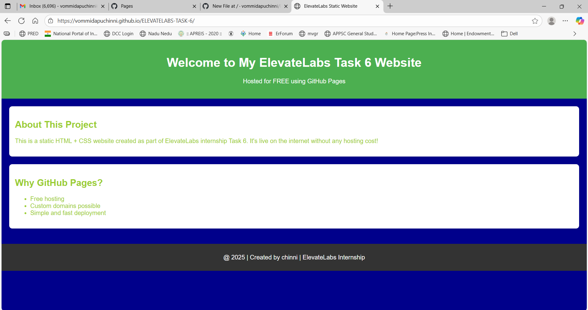

# ELEVATELABS - Task 6
Project Goal: Host a static website using GitHub Pages.

## What is this?
This is a simple HTML & CSS website hosted directly on **GitHub Pages**.  
It can be accessed by anyone online — no server needed.

## What I used
- HTML → Page content
- CSS → Page design
- GitHub → Storing my code
- GitHub Pages → Hosting my site

## Files in this project
- index.html → Main webpage
- style.css → Design and styles
- README.md → This file

## Screenshot

##  Live Website
[Click here to see my website](https://vommidapuchinni.github.io/ELEVATELABS-TASK-6/)

## How I hosted it
1. Created a **GitHub repository** for my project.  
2. Added my `index.html` and `style.css` files.  
3. Pushed the files to GitHub.  
4. Went to **Settings → Pages**.  
5. Selected branch `main` and folder `/ (root)`.  
6. Site went live in under a minute.

